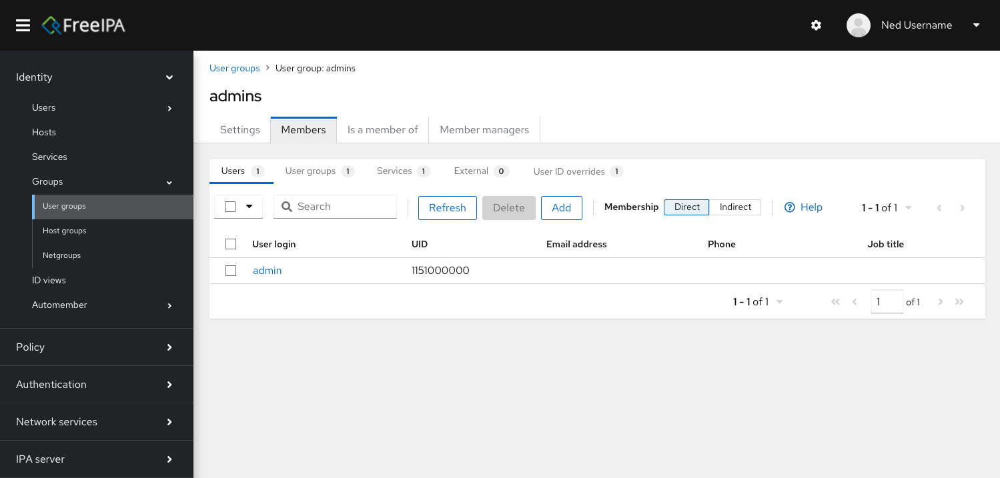
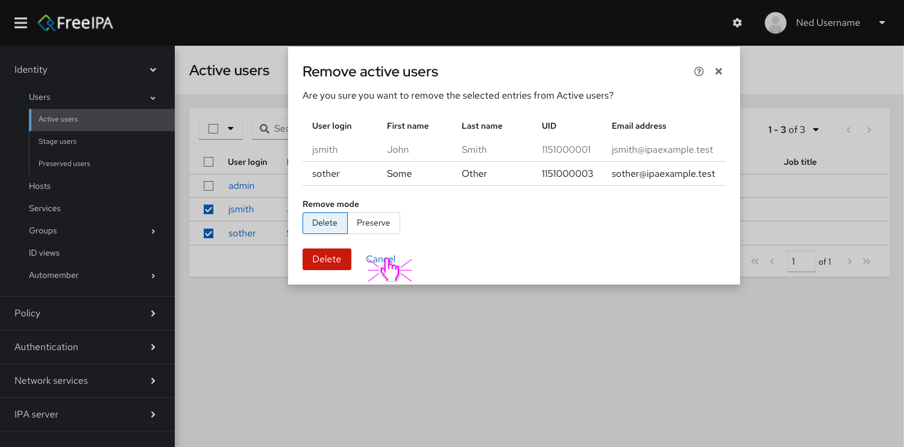
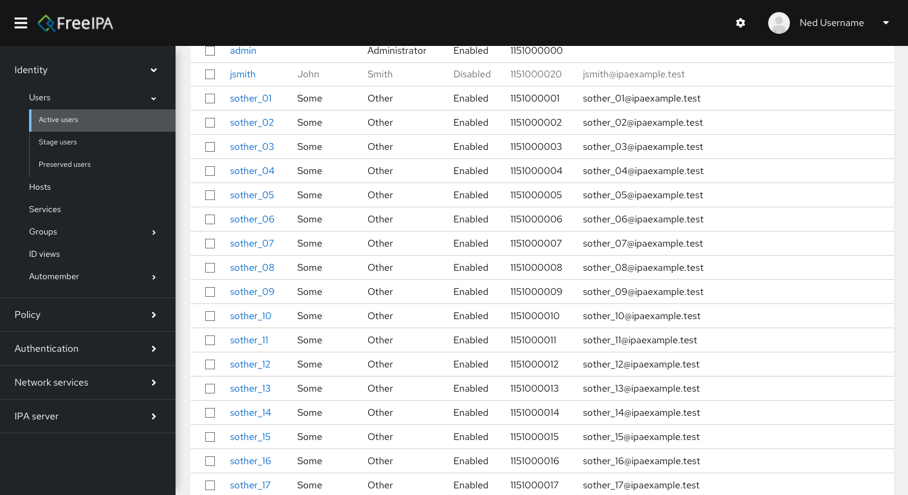
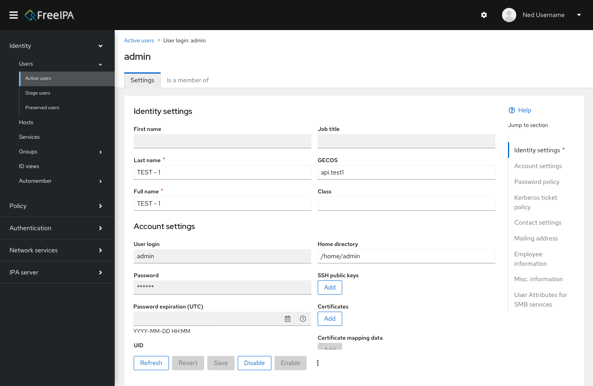

[](https://github.com/freeipa/freeipa-webui/actions/workflows/gating.yml)

# FreeIPA Web UI

New version of the web application for administration of FreeIPA built using
[React](https://reactjs.org/) and [PatternFly 5](https://v5-archive.patternfly.org/).

You can read more about the plans [here](https://github.com/freeipa/freeipa-webui/discussions/34).

## Mock-ups

**Note**: these mockups are for general direction we're taking the Web UI.
Some finer details and interactions will be worked out as we develop the application.






## Development environment

This project relies on Vagrant to set-up a virtual machine with FreeIPA installed
and configured.

1. Install requirements

> Although these instructions target Fedora as host, any OS with Vagrant can be used,
> `sshfs` and `libvirt` are the preffered options, if you plan to use a different distro,
> please update `Vagrantfile` accordingly.

```bash
$ sudo dnf install vagrant vagrant-libvirt vagrant-sshfs
```

2. Clone this repository

3. Start and provision the guest virtual machine: `vagrant up`

4. Add guest machine's IP address to your `/etc/hosts` pointing to its hostname, e.g:

```
192.168.122.5 server.ipa.demo
```

You can get the VM ip for the running VM by:

```bash
vagrant ssh-config | grep HostName | awk '{print $2}'
```

At this point you can access your live instance at `https://server.ipa.demo/ipa/ui/`.
However, you still need to configure your front-end environment, it's up to you to choose
between your host or guest machine.

> If you decide to use your guest machine, just ssh into it, go to the synced folder:
>
> ```bash
> $ vagrant ssh
> $ cd /usr/src/freeipa-webui/
> ```

Now you can install the project's dependencies:

```bash
$ npm install
```

To start a development server (and watch the project for changes), run:

```bash
$ npm run dev
```

You can also build the project for production using the following command:

```bash
$ npm run build
```

Now your dev environment is ready, you can do changes and see them at:
`https://server.ipa.demo/ipa/modern_ui/`

The default credentials are **admin** and **Secret123**.

## Testing

### Integration tests

Integration testing uses [Cypress](https://www.cypress.io) library, which runs [Gherkin-defined](https://cucumber.io/docs/gherkin) steps.

#### Launching the existing tests

> [!WARNING]  
> Never run integration tests on production server. Clean-up step would delete all existing entries, e.g. users.

1. Prepare a vagrant server as in `Development Environment`
2. if you want to launch all the tests in headless mode, execute

```bash
$ npm run cypress
```

if you want to open graphical debugger, execute

```bash
$ npm run cypress:open
```

and select desired feature file you want to execute.

#### Adding new tests

The integration tests use the **.feature** suffix and can be found in the _tests_ subfolder, together with the steps describing each feature.

### Unit tests

Unit tests use [vitest](https://vitest.dev).

#### Launching the existing tests

The existing tests can be launched by executing

```bash
$ npm test
```

#### Adding new tests

The unit tests live, where the component that is being tested lives, the name should be the same, only with the **.test.tsx** suffix instead.

If you require FreeIPA to be running, please use integration tests instead.

## License

FreeIPA Web UI is licensed under the [GPLv3+](./COPYING) as
[FreeIPA](https://github.com/freeipa/freeipa).
