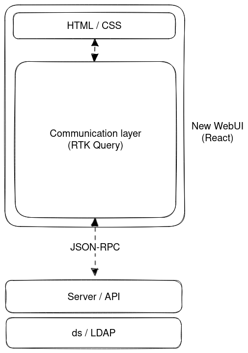

# Communication layer for the new WebUI

** DESIGN STAGE**

## Overview

Currently, the new WebUI uses dummy data to simulate the data being retrieved or modified, as a temporal
solution to help the development of the UI components. As the Front End is more consolidated now, it
becomes evident that we need to start using real data in the application to get the full range of features,
testing, and a more realistic feel.

The communication layer is used to allow the new webUI to execute API commands and perform CRUD
operations (Create, Read, Update, and Delete). These operations will manage the data from the
underlying IPA server, and hand then over back to the WebUI.

## Use Cases

The communication layer is necessary to provide users a way to access and manage API server data
from the new WebUI, thus replicating the same behavior as in the old WebUI.

## General considerations

### React in a nutshell

The new WebUI uses React in the Front End side to render the UI elements through components. Those
are independent and reusable bits of code that serve the same purpose as JavaScript functions, but work
in isolation and return HTML through JSX. In the context of the WebUI, a component can refer to a specific
page (e.g., 'Active users'), a reusable layout for the UI, or any bit of isolated functionality. Components
can be functional or class-based (being the first one the most extended type to use nowadays) and
can consume other components to enhance and expand its functionality.

Inside the components, it is possible to manage different properties by using the
[React Hooks](https://react.dev/reference/react): functions that let you "hook into" React `state` and
lifecycle features from function components. All hooks start with the reserved prefix `use` and it is
possible to use already-built hooks and create custom ones. A very useful hook to define and update
states in components (the ones that will manage the internal "variables") is `useState`. Also, the
states can be shared to other components to use the same value in different contexts of functionality.
There are two ways of propagating states:

- Via `props`: The most common way to do it. The `prop` is passed from the parent component to the children
  as property in a JSX tag. Due to the limited reach of this method, this can can be inconvenient if you
  have to pass the props through many components that will not use it. More information about this approach
  [here](https://beta.reactjs.org/learn/passing-props-to-a-component).
- By using other tools, such as [Context](https://beta.reactjs.org/learn/passing-data-deeply-with-context)
  or [Redux Toolkit](https://redux-toolkit.js.org/). These allow sharing data deeply without passing explicitely
  information through `props`, making it globally accessible from any component. The **new WebUI is using Redux
  Toolkit** because it provides a set of extra functionality and tools that Context does not have (see the
  'Differences between Redux Toolkit and Context' section).

### Redux Toolkit

[Redux Toolkit](https://redux-toolkit.js.org/) manages the "global" state logic through the `store`, a
file that contains the different `reducers` (`slices` of code where a specific subset of global variables can
be defined, initialized, and managed). When a `reducer` is created, it has to be referenced in the `store` so
that any component in the project can use it.

### Differences between Redux Toolkit and Context

- Integration with React applications: Context is a light-weight solution that ships with React while
  Redux toolkit is an external package that requires additional installation, driving up the final bundle size.
- Setup: Context requires [minimal setup](https://react.dev/learn/passing-data-deeply-with-context)
  (create the `Context` and use it via `useContext` hook). Redux Toolkit requires
  [more steps](https://redux-toolkit.js.org/tutorials/quick-start#usage-summary) to integrate it with
  a React application (create a `store`, provide it to React parent component, create a `slice`, add its
  `reducers` to the `store`, and use them from any component via hooks).
- Expand the functionality: Adding new contexts will require to create them from scratch. With Redux Toolkit is easier
  to add new data or actions to the same `slice` after the initial setup (for new `slices`, those just need to be
  created and added into the `store`).
- Mutability of the data: Context works well to manage static data that is not refreshed or updated very often,
  while Redux Toolkit works well with both static and dynamic data.
- Maintainability: Context is normally aimed for small and simple applications. Redux Toolkit provides better support
  for troubleshooting and testing large and complex applications.
- Ease of development: It will entirely depend on what is being implemented. Building an app with global state
  management will require similar lines of code independently whether Redux Toolkit or Context has been used (both require to
  subscribe to the state in order to re-render the components and both require a place to manage the state). The same
  applies when it comes to share states with nested components.
- Debugging: Is harder for Context to debug highly nested React component structures (even when using the Dev Tool),
  while Redux can rely on the [Redux Dev Tools](https://github.com/reduxjs/redux-devtools/tree/main/extension)
  extension to simplify the process.
- Included tools: Context only provides the basic functionality and nothing else. Redux Toolkit includes some
  [wrappers](https://redux-toolkit.js.org/introduction/getting-started#whats-included) to make it easier to
  configure, as well as the [RTK Query](https://redux-toolkit.js.org/introduction/getting-started#rtk-query) optional
  addon.

### IPA API

FreeIPA provides an API that can be accessed through Python or by using the `ipa <command>` from enrolled IPA
clients, allowing users to interact with FreeIPA programatically and develop custom tools to respond to specific
needs not covered by the main interfaces.

But it is also possible to perform operations from other frameworks or non-IPA clients. The current WebUI uses
the [API commands](https://freeipa.readthedocs.io/en/latest/api/commands.html) and issues JSON-RPC requests to
the server. After authenticating, the requests need to be posted to the `https://<HOST-NAME>/ipa/session/json`
endpoint and pass the method (corresponding to a given command) along with the parameters.

Example: Request to retrieve all user IDs by using the `"user_find"` method:

```bash
curl 'https://<HOST-NAME>/ipa/session/json' \
  -H 'Accept: application/json, text/javascript, */*; q=0.01' \
  -H 'Accept-Language: en-US,en;q=0.9' \
  -H 'Cache-Control: no-cache' \
  -H 'Connection: keep-alive' \
  -H 'Content-Type: application/json' \
  -H 'Cookie: ipa_session=<MY-COOKIE> \
  -H 'Origin: https://<HOST-NAME>' \
  -H 'Pragma: no-cache' \
  -H 'Referer: https://<HOST-NAME>/ipa/ui/' \
  -H 'Sec-Fetch-Dest: empty' \
  -H 'Sec-Fetch-Mode: cors' \
  -H 'Sec-Fetch-Site: same-origin' \
  -H 'User-Agent: Mozilla/5.0 (X11; Linux x86_64) AppleWebKit/537.36 (KHTML, like Gecko) Chrome/111.0.0.0 Safari/537.36' \
  -H 'X-Requested-With: XMLHttpRequest' \
  -H 'sec-ch-ua: "Google Chrome";v="111", "Not(A:Brand";v="8", "Chromium";v="111"' \
  -H 'sec-ch-ua-mobile: ?0' \
  -H 'sec-ch-ua-platform: "Linux"' \
  --data-raw '{"method":"user_find","params":[[""],{"pkey_only":true,"sizelimit":0,"version":"2.251"}]}' \
  --compressed \
  --insecure
```

Response:

```json
{
  "result": {
    "result": [
      {
        "uid": ["admin"],
        "dn": "uid=admin,cn=users,cn=accounts,dc=ipa,dc=demo"
      },
      {
        "uid": ["bwayne"],
        "dn": "uid=bwayne,cn=users,cn=accounts,dc=ipa,dc=demo"
      },
      {
        "uid": ["hqueen"],
        "dn": "uid=hqueen,cn=users,cn=accounts,dc=ipa,dc=demo"
      },
      { "uid": ["jdoe"], "dn": "uid=jdoe,cn=users,cn=accounts,dc=ipa,dc=demo" },
      { "uid": ["sman"], "dn": "uid=sman,cn=users,cn=accounts,dc=ipa,dc=demo" }
    ],
    "count": 4,
    "truncated": false,
    "summary": "4 users matched"
  },
  "error": null,
  "id": null,
  "principal": "admin@IPA.DEMO",
  "version": "4.9.11"
}
```

## Design



The main idea around the communication layer is to connect the WebUI and the IPA server by using
the API commands. This allows managing data from the server by using the WebUI:

- By accesing specific pages to retrieve data.
- By using the action or secondary buttons to update data.

For this reason, these API commands need to be consumed by React through a compatible library.
More details of the proposed solution are given in the 'Implementation' section.

As the new WebUI will be an independent package (`freeipa-webui`) that could be installed alongside
the old WebUI, is still TBD the way this will be integrated into FreeIPA (either before running the
`ipa-server-install` or on an already deployed server).

## Implementation

As the new WebUI is using React as Front End framework alongside with TypeScript, it is important to use
a compatible library that will allow to make API calls by using the command methods, similarly as the
current WebUI does. Also, since the API is using an RPC-based architecture, the number of possibilities
is considerably reduced compared to other architectures, such as REST.

A good option to consider for the development of the communication layer is the
[RTK Query library](https://redux-toolkit.js.org/rtk-query/overview). This is an optional addon included
in the [Redux Toolkit](https://redux-toolkit.js.org/) package, designed to simplify common cases for loading
data in web applications and provide data caching. It allows to define a set of endpoints to retrieve data
from a given API and transform the given response with a specific configuration or data type. Compared to
[other React tools](https://redux-toolkit.js.org/rtk-query/comparison#comparing-feature-sets), this is a very
versatile one and support any type of protocol.

As the IPA API uses JSON-RPC, all the API calls will point directly to the `ipa/session/json` URL and the API
methods and parameters will be passed as part of the body call.

Example for single commands (using RTK Query):

```ts
export interface Command {
  method: string;
  params: any[];
}

const getCommand = (commandData: Command) => {
  const payloadWithParams = {
    url: "ipa/session/json",
    method: "POST",
    body: {
      method: commandData.method,
      params: commandData.params,
    },
  };
  return payloadWithParams;
};
```

Example for batch commands (using RTK Query):

```ts
const getBatchCommand = (commandData: Command[]) => {
  const payloadBatchParams = {
    url: "ipa/session/json",
    method: "POST",
    body: {
      method: "batch",
      params: [
        commandData.map((cmd) => cmd),
        {
          version: "2.251", // This could be taken from global settings
        },
      ],
    },
  };
  return payloadBatchParams;
};
```

These definitions are used in the `createApi` function that will define the entrypoints to the calls
([usage](https://redux-toolkit.js.org/rtk-query/api/createApi)):

```ts
export const api = createApi({
  baseQuery: fetchBaseQuery({ baseUrl: "/" }), // This could be taken from global settings
  endpoints: (build) => ({
    simpleCommand: build.query<RPCResponse<object>, Command | void>({
      query: (payloadData: Command) => getCommand(payloadData),
    }),
    commandWithParams: build.mutation<RPCResponse2<object>, Command>({
      query: (payloadData: Command) => getCommand(payloadData),
    }),
    batchCommand: build.query<RPCResponse2<object>, Command[] | void>({
      query: (payloadData: Command[]) => getBatchCommand(payloadData),
    }),
  }),
});
```

After the endpoints are defined, those should be exported as hooks using the `use-` prefix
and the type of endpoint as suffix (`Query` | `Mutation`). The main difference between these
two types is that the [Queries](https://redux-toolkit.js.org/rtk-query/usage/queries) are
normally meant for data retrieval and should be used inside the main component function only.
The [Mutations](https://redux-toolkit.js.org/rtk-query/usage/mutations) are used for updating
the data and can be called inside of a inner function as a side-effect (e.g., when clicking
the 'Add' button inside of the `addUserHandler()` function).

```ts
export const {
  useSimpleCommandQuery,
  useCommandWithParamsMutation,
  useBatchCommandQuery,
} = api;
```

Finally, the already-defined endpoints can be consumed as hooks from the components that
refers to a specific page (e.g., The active users' list will be retrieved via API call
from the `ActiveUsers` component, that refers to the 'Active users' base page). This data
will be page-specific and will be rendered each time the page components are initialized.

```ts
// Retrieve all uids
// 1. Preparing the call data
const payloadDataUids: Command = {
  method: "user_find",
  params: [
    [],
    {
      pkey_only: true,
      sizelimit: 0,
      version: "2.251",
    },
  ],
};

// 2. Making the call (hook)
const {
  data: userIdsData,
  error: uidsError,
  isLoading: areUidsLoading,
} = useSimpleCommandQuery(payloadDataUids);
```

At this point, the response data will be stored in `userIdsData` as a JavaScript Object, ready to be used.
If there was an error making the API call, the error data will be stored in `uidsError`. To manage the
state of the asynchronous call, `areUidsLoading` provides a boolean to determine whether the call has
finished or not. This is very useful to tracking loading state in order to show UI elements such as
[Spinners](https://www.patternfly.org/v4/components/spinner).

After getting a response data from a Query call, if this contains full information about a
specific entity (e.g., User, Host, Service, etc), there is a possiblity to store that information
in a Redux Toolkit `slice`. This has the benefit of greatly reducing the number of API calls
to get the same data and allows it to be cached and accessible by any component of the application.
However, this stored data must be updated (retrieved again and written to the `slice`) each time a
list Mutation is made or some parameter is changed (e.g., a new user is added, a specific field is
modified, a host is removed, etc.).

## Feature Management

### UI

The feature will be used in the WebUI only.

### CLI

N/A

### Configuration

N/A

## Upgrade

The Communication Layer will depend on the RTK Query library
[releases](https://github.com/reduxjs/redux-toolkit/releases), so regular checks to the latests
versions will be needed. This could be done by adding a job inside the Github CI that keeps the library
updated.

For those new components that require retrieving or managing information from the API (as long as
there is a command available), one of the already defined hooks can be used in the new component.
In case the response value differs from the existing ones (see 'Troubleshooting and debugging' section),
it will be necessary to define a new data type and a new entrypoint as well.

## Test plan

Existing CI tests will be rewritten for the whole WebUI to match new React structure. TBD.

## Troubleshooting and debugging

The information related to API call errors should be given by the `error` variable when invoking
the hook. Example:

```ts
const { data, error: myError, isLoading } = useMyEndpointQuery(myPayloadData);
// `myError` contains the error message
```

Other errors can be related to the specific response data type. When defining the endpoints, the
response type should be explicitely specified (as TypeScript requires). In terms of structure,
there are two types of response, depending on whether the call is against a single command or a batch:

```ts
// Single command - Response
//   - Has 'result' > 'result' structure
interface RPCResponse<ResultType> {
  error: string;
  id: string;
  principal: string;
  version: string;
  result: {
    result: ResultType;
    count: number;
    truncated: boolean;
    summary: string;
  };
}

// Batch - Response
//   - Has 'result' > 'results' > 'result' structure
//   - More data under 'result'
interface RPCResponse2<ResultType> {
  error: string;
  id: string;
  principal: string;
  version: string;
  result: {
    count: number;
    results: {
      result: ResultType;
      truncated: boolean;
      summary: string;
    };
  };
}
```
