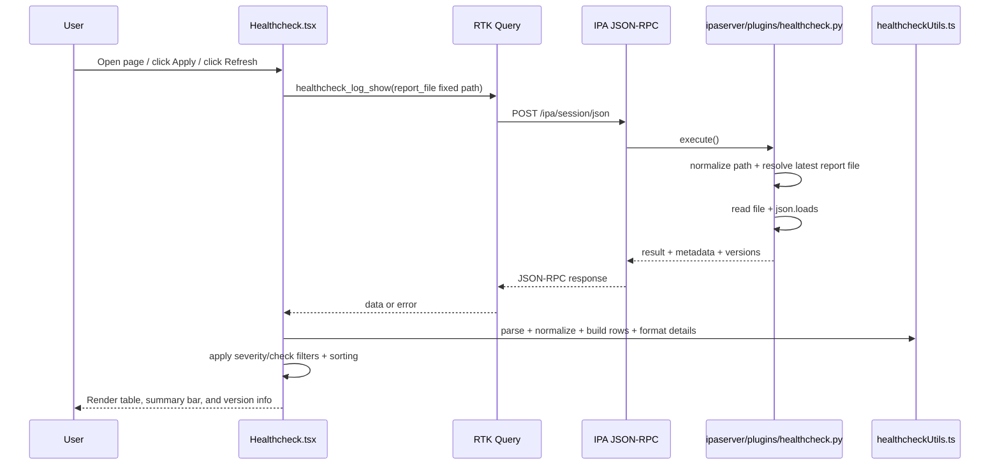

# Healthcheck (Web UI)

This page renders **ipa-healthcheck** results via IPA JSON-RPC command
`healthcheck_log_show`. It is a file-based Healthcheck view in Web UI with
sorting, filtering, and user-focused details text.

---

## Current behavior

- Uses fixed server path: `/var/log/ipa/healthcheck/healthcheck.log`
- Auto-loads data when page opens; also supports **Apply** and **Refresh**
- Uses latest matching report file (`healthcheck.log` / `healthcheck.log.*`) on IPA server
- Shows top-right versions:
  - `ipa-healthcheck` (installed RPM / tool output)
  - `IPA`
  - `PKI`
- Supports:
  - severity **multi-select dropdown** (All severities + CRITICAL / ERROR / WARNING / SUCCESS)
  - clickable severity summary bar (quick filter to one level)
  - checks multi-select dropdown with **All**
  - sortable table headers; **Result** column uses severity order (not plain A–Z)

---

## Files

### Web UI (`freeipa-webui`)

| File | Purpose |
| --- | --- |
| `src/hooks/useHealthcheckData.tsx` | RPC load, alerts, normalization, metadata, and severity totals (same role as other `use*Data` hooks). |
| `src/pages/Healthcheck/Healthcheck.tsx` | Page shell: filters, toolbar, layout; composes subcomponents. |
| `src/pages/Healthcheck/HealthcheckResultsTable.tsx` | Results table + scroll containers. |
| `src/pages/Healthcheck/HealthcheckSeverityBar.tsx` | Clickable severity summary bar. |
| `src/pages/Healthcheck/HealthcheckCheckInfoPopoverBody.tsx` | Check info popover content. |
| `src/pages/Healthcheck/healthcheckConstants.ts` | Shared UI constants and display helpers. |
| `src/pages/Healthcheck/healthcheckTypes.ts` | Shared sort column types. |
| `src/pages/Healthcheck/healthcheckUtils.ts` | Pure helpers: parse/normalize payload, row shaping, severity helpers, and check-specific details formatting. |
| `src/pages/Healthcheck/healthcheckCheckDocs.ts` | Short upstream check descriptions for the popover. |
| `src/pages/Healthcheck/README.md` | This document. |

### IPA server (`freeipa`)

| File                               | Purpose                                                                                                                   |
| ---------------------------------- | ------------------------------------------------------------------------------------------------------------------------- |
| `ipaserver/plugins/healthcheck.py` | RPC command `healthcheck_log_show`: read report file (with latest file resolution), parse JSON, return metadata/versions. |

---

## Notable utility behavior (`healthcheckUtils.ts`)

- `parseHealthcheckLogShowBody` parses full RPC payload including metadata fields.
- `buildHealthcheckTableRows` groups similar checks (`source + check + result`) and
  preserves latest timestamp in grouped row.
- `formatHealthcheckCellDetails` provides check-specific user-friendly details for:
  - certificate expiration/trust-flag checks
  - keytab checks
  - topology suffix checks
  - file ownership/permission checks
  - dogtag connectivity checks
  - meta checks
- Details rendering is normalized in UI to one line, with consistent separators.

---

## End-to-end flow

---

## Testing

Tests to be done.
